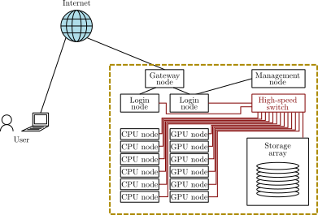
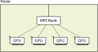

```shellsession
$ sbatch efficient_job.sh
```

Script:
We now know enough about HPC systems to think about
how to submit jobs that will take best advantage of the given machine that we're using.

-

 <!-- .element width="400px" style="margin: 50px;" -->
 <!-- .element width="400px" style="margin: 50px;" -->

 <!-- .element width="300px" style="vertical-align: middle; margin: 50px;" -->
 <!-- .element width="400px" style="vertical-align: middle; margin: 50px;" -->

Script:
The first step is to know whether the code we’re using has OpenMP, MPI, or both,
and whether it is GPU-enabled or CPU-only.

-

 <!-- .element height="700px" -->

Script:
We also need to know some details of our cluster,
as discussed in a previous video:
how many nodes,
what partitions are available,
are any GPU-enabled,
how many sockets per node and cores per socket,
etc.
Your cluster documentation should tell you most of this.

-

 <!-- .element width="500px" style="margin: 50px;" -->
 <!-- .element width="500px" style="margin: 50px;" -->

 <!-- .element width="1200px" -->

Script:
Let’s say for now that we’re using a machine with two 64-core CPUs per node,
each with 4 chiplets.
50% of the nodes have 4 GPUs,
each with a dedicated network adapter directly connected to it.
The other half have two network adapters,
one per CPU.
The network has 2:1 blocking,
with 6 nodes per switch.

-

 <!-- .element width="150px" -->

<div style="float: left; width: 30%;">

 <!-- .element width="400px" class="fragment" -->

</div>

<div style="float: right; width: 69%;">

<div class="fragment">

$128=2^7$ cores

</div>

<div class="fragment">

$$\begin{aligned}
& 54\times30\times30\times30 \\\\
=& (27\times15\times15\times15)\times(2\times2\times2\times2)\\\\
=&(27\times15\times6\times6)\times(2\times2\times5\times5)
\end{aligned}
$$

</div>

<div class="fragment">

$$
\begin{aligned}
&56\times32\times32\times32 \\\\
=&(7\times4\times16\times32)\times(8\times8\times2\times1)\\\\
=&(56\times16\times4\times4)\times(1\times2\times8\times8)
\end{aligned}$$

</div>

</div>

Script:
Let’s start by thinking about a pure MPI code,
with no multithreading or GPU support.
[click]
These work by partitioning the global lattice volume into equally-sized subvolumes.
Our first concern is to make sure that we use as many cores on each node as we can.
128,
or $2^7$,
cores per node imposes some soft constraints on our lattice volume.
Say that a collaborator has suggested
using a $54\times30\times30\times30$ lattice volume.
If we only use the powers of two from the number of cores per node,
we can only divide this into $2^4=16$ partitions,
which is nowhere near using the entire node.
We could instead use a $2\times2\times5\times5$ to use 100 cores,
which is closer.
However,
adjusting the volume slightly to $56\times32\times32\times32$
gives us eighteen powers of two available,
so we can partition as $1\times2\times8\times8$ and occupy every core.
We might also want to test $8\times2\times1\times1$
to see which order of filling gives better performance.

-

~~~ bash
#!/bin/bash
#SBATCH --partition=cpu
#SBATCH --nodes 1
#SBATCH --ntasks-per-node=128
...
MPI=1.2.8.8
...
~~~

~~~ bash
#!/bin/bash
#SBATCH --partition=cpu
#SBATCH --nodes 2
#SBATCH --ntasks-per-node=128
...
MPI=1.4.8.8
...
~~~
<!-- .element class="fragment" -->

Script:
Now we can write a job script to use 1 node and 128 tasks per node,
and test the performance.
[click]
If we suspect that this will not be fast enough,
we can also submit a second job using 2 nodes
(and still 128 tasks per node),
perhaps with the parallelisation $1\times4\times8\times8$,
and compare the performance of the two.

-

$$
54 \times 30 \times 30 \times 30 \not\equiv 56 \times 32 \times 32 \times 32
$$

<div style="float: left; width: 49%;">

 <!-- .element height="400px" class="fragment" -->

</div>


<div style="float: right; width: 49%; margin-top: 100px;" class="fragment">

~~~ bash
#!/bin/bash
#SBATCH --partition=cpu
#SBATCH --nodes 2
#SBATCH --ntasks-per-node=100
#SBATCH --ntasks-per-socket=50
...
MPI=2.2.5.5
...
~~~
<!-- .element class="fragment" -->

</div>

Script:
Of course,
depending on the physics you are looking at,
you might not be able to get the answer you're looking for
from a different lattice volume.
But if you're interested in the infinite volume limit,
then in some cases you may be able to get a larger volume in less time.
[click]
Another complication is that
the ability to transfer data from RAM to the CPU
can be the bottleneck in some lattice computations.
In that case,
moving from using 100 cores per node to 128
may not actually use any more of the node's performance,
if the limiting factor was outside of the CPU.
[click]
Given that the RAM is the bottleneck,
it's important to also make sure that the CPUs are evenly loaded,
otherwise you might lose performance because one CPU is overloaded
while another has memory bandwidth to spare.
Either way,
you should always test your assumptions before starting large production runs,
to verify that you're getting the best performance you can.

-

$$E_{N\textrm{ nodes}} = \frac{t_{\textrm{1 node}}}{N_{\mathrm{nodes}} \cdot t_{N\textrm{ nodes}}}$$

<div class="fragment">

$$t_{\mathrm{2 nodes}} = \frac{1}{2} t_{\mathrm{1 node}}
\Rightarrow 
E_{\textrm{2 nodes}} = \frac{t_{\mathrm{1 node}}}{2\cdot \frac{1}{2} t_{\mathrm{1 node}}} = 1$$

</div>

Script:
How do we compare the performance to make sure that using multiple nodes is worthwhile?
If the time taken to run a task on two nodes is
half that it would take to run the same task on one node,
then we have lost nothing from the parallelism:
the number of node-hours spent is the same between the two.
From this,
we can define the efficiency as
the time to solution on one node
divided by the number of nodes
times the time to solution on the node count of interest.
[click]
The ideal scaling case we just discussed has an efficiency of 1.
We want this number to be relatively high.
100% efficiency is hard to keep on multiple nodes,
but below 50% is definitely wasteful and should be avoided.
The optimum value will depend on many other factors:
how busy the cluster is,
how many other jobs you need to run concurrently,
and how long you can wait for your full statistics.

-

 <!-- .element height="600px" -->

Script:
Now we can keep testing higher numbers of nodes until the efficiency drops too low.
Something that can be helpful once we are studying varying node counts
is a plot of the performance as a function of the node count.
If we plot the reciprocal of the time to solution against the node count,
then perfect scaling would give a straight line through the origin.
We can better visualise the dropoff in performance,
which can help identify the compromise point of performance versus wastage.
This is an example of strong scaling:
we have kept the physics fixed,
and have tried to get more performance by throwing more resources at the problem.

-

 <!-- .element width="150px" style="margin: 25px; vertical-align: middle;" -->
+
 <!-- .element width="150px" style="margin: 25px; vertical-align: middle;" -->

<span class="fragment">

2 CPUs $\times$ 4 chiplets/CPU = 8 chiplets $\Rightarrow$ 8 ranks

</span>

<span class="fragment">

128 $/$ 8 = 16 threads per rank

</span>

```bash
#!/bin/bash
#SBATCH --partition=cpu
#SBATCH --nodes 1
#SBATCH --ntasks-per-node=8
#SBATCH --cpus-per-task=16
...
```
<!-- .element class="fragment" -->

Script:
Now let's consider an example with both MPI and OpenMP.
Because OpenMP doesn't deal well with transfers between chips or chiplets,
we want to have one MPI task for each chiplet,
and use OpenMP to distribute work among the cores within it.
So in our example 128-core CPU node,
[click]
we want to have 8 MPI ranks,
[click]
each having 16 OpenMP threads.
[click]
To specify this to Slurm,
we now want to use the `--cpus-per-task` option
in addition to the `--ntasks-per-node` option.`
As before,
let's start from one node.

-

 <!-- .element height="400px" style="margin: 50px;" -->
 <!-- .element class="fragment" height="400px" style="margin: 50px;" -->

Script:
In this case,
it's best to double-check our assumptions on the number of ranks per node.
We could for example check what happens with two tasks per node
(and 64 cores per task),
and with 16 tasks 
(and 8 CPUs per task).
Once that is done,
we can pick the fastest option,
[click]
and then test the strong scaling to multiple nodes,
similarly to the pure MPI case.

-

```bash
#!/bin/bash
#SBATCH --partition=gpu
#SBATCH --gres=gpu:4
...
```

Script:
What about a GPU-enabled code?
First of all,
we'll need to switch to the GPU partition,
and tell Slurm that we want to use 4 GPUs per node,
since that's what we know these nodes have.
Your cluster might have a slightly different way of specifying the GPUs to allocate,
and may have a different number of GPUs per node,
so do check with your cluster's documentation
so that you know you're doing the right thing.

-

 <!-- .element width="500px" style="margin: 50px;" -->
 <!-- .element class="fragment" width="500px" style="margin: 50px;" -->

Script:
Then we'll also need to consult the documentation
for both the software and for the cluster,
to see how things are configured for running on multiple GPUs.
Code can be written to use multiple GPUs from a single,
usually multithreaded,
process,
[click]
or to use one GPU per process with MPI communication between them.
It also needs to know which CPU to run on to get fastest access to each GPU,
and similarly which network interface to use.

-

<div style="float: left; width: 37%;">

[ <!-- .element style="margin-left: 40px;" height="250px" -->](https://github.com/paboyle/Grid)

 <!-- .element width="500px" style="margin: 50px;" -->

</div>

<div style="float: right; width: 62%; margin-top: 100px;">

```bash
#!/bin/bash

lrank=$OMPI_COMM_WORLD_LOCAL_RANK
numa1=$(( 2 * $lrank))
numa2=$(( 2 * $lrank + 1 ))
netdev=mlx5_${lrank}:1

export CUDA_VISIBLE_DEVICES=$OMPI_COMM_WORLD_LOCAL_RANK
export UCX_NET_DEVICES=mlx5_${lrank}:1
BINDING="--interleave=$numa1,$numa2"

echo "`hostname` - $lrank 
   device=$CUDA_VISIBLE_DEVICES, binding=$BINDING"

numactl ${BINDING}  $*
```

</div>

Script:
For example,
the Grid code uses one process per GPU.
It can be configured to use GPUs configured by the MPI library on some systems,
but usually requires using a wrapper to set environment variables and CPU bindings.
Examples are provided on the Grid GitHub repository.
Writing your own wrapper for a new system is more advanced,
and will be covered in a separate video.

-

```bash
#!/bin/bash
#SBATCH --partition=gpu
#SBATCH --gres=gpu:4
#SBATCH --nodes=4
#SBATCH --ntasks-per-node=4
#SBATCH --cpus-per-task=32
#SBATCH --time 1-0:00:00

module purge
module load gcc/9.3.0 openmpi/4.1.1 cuda/12.4.1

srun ${HOME}/bin/mpiwrapper.sh ${HOME}/src/awesomelat/build/hmc -i input_file
```

Script:
Armed with that knowledge,
we can write our job script.
We want 4 tasks per node,
32 CPUs per task,
and we should add the wrapper script in front of the program that we want to run,
but after the MPI launcher,
since the wrapper needs to know the MPI rank to be able to configure properly.

-

 <!-- .element height="600px" -->

Script:
As with a CPU code,
we still want to test the efficiency before scaling our production runs to multiple nodes.
For GPUs in particular,
without a properly tuned setup,
it's likely that multiple nodes will give slower performance than a single one.
In the case in the illustration,
you can see that the initial attempt without a wrapper script
showed no performance improvement from going to multiple GPUs.
The second attempt got good performance on one node,
but failed to see an improvement from using multiple nodes.
The finalised wrapper script is able to get good strong scaling on multiple nodes,
although inevitably falling off at larger node counts.

-

<div style="float: right; width: 40%;">

 <!-- .element width="500px" -->

</div>

<div style="float: left; width: 59%;">

```bash
#!/bin/bash
#SBATCH --partition=gpu
#SBATCH --gres=gpu:4
#SBATCH --nodes=4
#SBATCH --ntasks-per-node=4
#SBATCH --cpus-per-task=32
#SBATCH --time 1-0:00:00

module purge
module load gcc/9.3.0 cuda/12.4.1

GPU_ID=0

for directory in generation/beta*
do
    cd "${directory}"
    export CUDA_VISIBLE_DEVICES=${GPU_ID}
    ${HOME}/src/awesomelat/build/hmc -i input_file &
    GPU_ID=$[${GPU_ID}+1]
    cd -
done

wait
```

<!-- .element style="height: 600px;" -->

Script:
Modern high-end GPUs are powerful enough that they need a lot of work to be kept busy;
this means that for smaller local lattices they will spend more time idling,
and you won’t see much speedup from using multiple GPUs.
In these cases,
you could try running one ensemble per GPU:
some machines will let you use separate jobs for this,
while others will need you to batch up your work.
One way of doing this is shown on screen:
you can usually use the `CUDA_VISIBLE_DEVICES` environment variable
to control which GPU gets used.
This doesn't control which CPUs are used,
however,
so you may see slightly better performance from using a more specific wrapper script.

-

<div class="r-stack">

 <!-- .element height="700px" class="fragment current-visible"-->

 <!-- .element height="700px" class="fragment current-visible"-->

</div>

Script:
Before we wrap up,
let’s talk about time limits.
Your first thought might be to try and get as many iterations out per job as possible,
so to use the maximum time limit that the system/partition allows.
But remember that other people are using the system,
submitting a variety of job sizes.
If the job at the top of the queue is large and doesn’t have enough nodes free to start,
then the scheduler will wait for nodes to become available.
But if there are some short jobs that could use those free nodes,
and still finish before the big job is expected to start,
then it can slot those into the gap,
letting them jump the queue.
[click]
So if you have some jobs that can do useful work in a handful of hours
(even if it’s a smaller number of iterations),
then it might be worth doing so
(with a corresponding short time limit,
so the scheduler knows it can fit them in).
Different clusters have different mixes of workloads,
so this isn’t always guaranteed to work,
but is worth bearing in mind.

-

- Understand resources
- Know capabilities of software
- Use MPI to partition lattice
- Use GPUs or OpenMP threads where available
- Test scaling of software on target machine
- Don't scale into diminishing or negative returns
- Consider shrinking jobs to get faster turnaround

Script:
To sum up,
we need to understand what resources we have available,
and what resources our programs are able to use.
We partition our lattice with MPI,
and on top of that can use either OpenMP to parallelise across CPU cores,
or offload work to GPUs.
Regardless,
we need to do a strong scaling study to understand how much parallelism is worthwhile,
and to know that we do see a speedup from using multiple nodes.
Scaling beyond the point where we see a speedup is a waste of resources,
and to be avoided.
On very busy clusters,
we may also consider making our jobs smaller
so they can get through the queue more easily.
