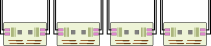
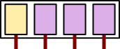

 <!-- .element height="700px" -->

Script:
We've already seen that an HPC system comprises some number of compute nodes.
Let's take a look inside one.

-

<!-- .element data-transition="slide-in fade-out" -->

 <!-- .element height="600px" -->

Script:
Every node will have some number of CPUs.
In older nodes this may be 1 CPU,
but most recent nodes will have 2.
(Very rarely you will encounter a node with 4 CPUs,
typically on machines with very large amounts of memory.)
Different CPUs on the same node have an interconnect connecting them,
so data can transfer between them.

-

<!-- .element data-transition="fade-in slide-out" -->

 <!-- .element height="600px" -->

Script:
Each CPU will be directly connected to some amount of the system’s memory,
or RAM,
by a very fast interconnect.
This is where data are stored while programs are using them
(as opposed to the disk, where they are stored for the longer term).
To access the rest of the RAM,
the CPU will need to ask another CPU to fetch the data on its behalf,
which slows things down.

-

 <!-- .element height="600px" -->

Script:
Each CPU will contain some number of CPU cores.
The exact number will depend on the manufacturer and specification.
Common numbers for recent chips from Intel are 8–64,
and for AMD 16–96.
Each core is the smallest computational unit that can run independent computations.
In principle,
a 20-core CPU could run 20 independent programs concurrently
(although they may all still end up competing for access to the RAM).
Any more programs,
and some cores will have to alternate between two different programs,
which will slow both programs down.

-

 <!-- .element height="600px" -->

Script:
Some CPUs will let multiple threads run in parallel on a core,
while sharing some computational elements,
such as the units for floating-point computations.
Using multiple threads per core does not usually give a performance increase for lattice code,
as it is very floating-point intensive,
but there are exceptions,
so it is worth testing.

-

 <!-- .element height="600px" -->

Script:
Some CPUs,
particularly recent AMD ones,
group their CPU cores into "chiplets",
which each behave similarly to a separate CPU,
having their own memory controllers and controlling separate areas of RAM.
At a high level you can treat these as if they were independent CPUs:
you should test whether this gives a performance boost or penalty
over ignoring this level of structure.

-

<!-- .element data-transition="slide-in fade-out" -->

 <!-- .element height="600px" -->

Script:
The amount of RAM available on a node may vary significantly
depending on what the machine was designed for.
You may see as low as 0.5GB of RAM per CPU core
(e.g. 64GB on a 128-core node),
or as high as 40GB per core
(e.g. 1.5TB on a 40-core node).
Since in lattice we typically apply all cores on the node to the same problem to get better speed,
even relatively small memory per core is not usually a barrier for us.
If our lattice won’t fit in a single node’s memory,
then it is probably slow enough to compute
that we would want to use multiple nodes in parallel anyway.
What is more important in lattice is the memory bandwidth,
i.e. the rate at which data can be got out of RAM.
This is frequently the bottleneck in lattice computation,
so we do need to take care to not create unnecessary bottlenecks here.

-

<!-- .element data-transition="fade-in slide-out" -->

 <!-- .element height="600px" -->

Script:
A node may also have one or more GPUs in.
Some machines will have all nodes with GPUs,
some none,
and some with a subset of GPU-enabled nodes.
GPUs were originally designed to speed up the display of 3D graphics,
but they have been increasingly used to speed up other computations as well.

-

CPU:

$$\begin{aligned}
y_1 &\leftarrow 1 + c_1 \sin(x_1) - \cot(x_2) \\\\
y_2 &\leftarrow 3 - c_7 \cos(x_1) + \tan(x_3) \\\\
&\vdots
\end{aligned}$$

GPU:

$$\begin{aligned}
y_i &= c_i + d_i x_i ^n, \\\\
&i=(1,\ldots,L^4)
\end{aligned}
$$

Script:
GPUs,
similar to CPUs,
can perform computations,
but the range of computations they can perform is more limited.
In exchange,
GPUs can perform many more of these simultaneously,
giving much faster performance than a CPU of a given price
or at a given amount of electrical power.
GPUs excel at performing the same computation to each element of a large,
flat data structure.
Many of the operations in lattice computations fall under this umbrella,
and indeed GPUs can give a significant performance boost to lattice code.
However,
currently they need to be explicitly programmed for to get good performance.
Not every lattice code will have GPU support,
and for those that do you should
compare the performance with using a CPU before deciding whether to use a GPU node.

-

<!-- .element data-transition="slide-in fade-out" -->

 <!-- .element height="600px" -->

Script:
While GPUs can perform very fast computations when they have the information they need,
they can take
(in relative terms)
a long time to communicate with the rest of the system.
This has a significant impact on not only how software is developed,
but how it is run.

-

<!-- .element data-transition="fade-in fade-out" -->

 <!-- .element height="600px" -->

Script:
GPUs are managed by one or other of the CPUs;
if you have two GPUs work together
that are attached to different CPUs
without any other connection between them, then
this may be slower than GPUs that attach to the same CPU.
GPUs can also be connected together via a direct GPU-GPU connection to help them cooperate.
For NVIDIA cards this is called NVLink.

-

<!-- .element data-transition="fade-in slide-out" -->

 <!-- .element height="600px" -->

Script:
Each node will also have one or more adapters to connect it to the high-speed network
(the interconnect, or fabric).
Each will be directly connected to only one of the CPUs,
frequently on the same bus as the GPUs.
Because node-node communication is generally slower than GPU-CPU communication,
the problem of GPU-GPU communication gets worse
when computations need to scale to multiple nodes.
For lattice computations,
one generally needs a dedicated network card for each GPU,
and technologies like GPUDirect
to let the GPU communicate directly with the network interface without going via the CPU,
to see a speedup from using multiple nodes.
(It’s crucial to benchmark your code before you start running significant volumes of work,
to make sure that you aren’t throwing away resources.)

-

 <!-- .element width="1200px" -->

Script:
Speaking of interconnects,
let’s move out now and look at how nodes connect together.

-

 <!-- .element height="250px" style="margin: 40px" -->
 <!-- .element height="250px" style="margin: 40px" -->
 <!-- .element heidth="250px" style="margin: 40px" -->

Script:
The vast majority of clusters use Infiniband networks provided by NVIDIA Networking, 
formerly known as Mellanox.
Alternatives include the Omni-Path Interconnect,
originally created by Intel and now owned by Cornelis Networks,
and very fast Ethernet links,
for example 100Gb/s or more,
similar to those that are used for
slower connections between lower-performance machines.

-

<!-- .element data-transition="slide-in fade-out" -->

 <!-- .element width="1200px" -->

Script:
Networks typically use switches to route traffic from one node to another.
We could connect all nodes to a single switch,
but this would lead to very long cables,
and the speed of light would introduce a noticeable amount of latency.

-

<!-- .element data-transition="fade-in fade-out" -->

 <!-- .element width="1200px" -->

Script:
Instead,
most clusters use a larger number of smaller switches,
with shorter cable runs.
These switches are then connected together by another switch.
Sometimes,
in really big clusters,
there is another layer of switches too!

-

<!-- .element data-transition="fade-in slide-out" -->

 <!-- .element width="1200px" -->

Script:
Ideally,
we would like every connection from a node to a switch 
to be matched by a connection from that switch to the central core switch.
But switches with lots of ports are expensive,
as are Infiniband cables.
So many clusters use "blocking",
and have fewer connections to the core switch than there are nodes attached.
Blocking fabrics will usually show
a significant performance drop for lattice computations
when your job spans multiple switches.
Schedulers frequently allow you to specify ways
to constrain your computation to a single switch,
and some clusters enforce this constraint by default;
in this case,
only when your job is too large to fit into a single switch
would it be split across multiple.
Even in a non-blocking fabric,
there is still a performance penalty from using multiple switches:
each switch to touch the traffic introduces latency,
as does the speed of light going to and from the core switch.
Even having one node on the wrong side of a core switch introduces this delay,
since all the other nodes have to wait for it to catch up after each iteration.

-

 <!-- .element height="600px" -->

Script:
Some clusters use other topologies of network.
One that works well for lattice computations is a hypercube/hypertorus,
where nearest neighbours in $N$ dimensions are directly connected to each other.
This removes a lot of switch latency,
but is quite specific to lattice problems,
so isn’t found on many general-purpose machines.

-

![Two diagrams.
One labeled `$ ./AwesomeLat`,
has a single box with a single line entering and leaving,
that splits into multiple threads and then joins back to the original line
at various points.
The multiple threads are labeled "parallel section",
and the single thread areas "serial section".
The other,
labeled `$ mpirun -n 4 ./AwesomeLat`,
has four boxes each with a single line from top to bottom with no forks,
but with arrows from one box to the other at various points.
These are labeled "messages".](./images/parallelism-modes.svg) <!-- .element height="600px" -->

Script:
A quick aside:
there are two main programming models available for writing parallel programs:
Multithreading,
most frequently encountered via OpenMP,
starts with running a single executable,
which then forks a number of threads.
These share the same memory address space as the parent process,
and can only run on the same node.
This can be a quick and effective way of
getting parallel computation within a single node,
but does not help us scale to use more than one node.
Message passing,
for example via the Message Passing Interface, MPI,
involves starting multiple copies of a program,
which then communicate with each other by sending messages across a network.
This can work both for parallelising within a node,
and scaling out to multiple nodes.

-

 <!-- .element height="600px" -->

Script:
Because the way you partition the lattice is different between these two models,
many codes combine both techniques,
using OpenMP where cores share the same memory,
and then MPI to communicate between different memory spaces
(for example,
sockets or nodes).

-

 <!-- .element height="700px" -->

Script:
The network fabric is also used to connect to high-speed network storage.
Similarly to computation,
the storage achieves high speed and capacity by having a large number of servers,
but in this case,
each serves either data or metadata.

-

<!-- .element data-transition="slide-in fade-out" -->

 <!-- .element height="600px" -->

Script:
Yes,
there are specific nodes just for storing the filenames,
directories,
and what nodes the actual data can be found on.
Since these can run out of space,
sometimes machines will impose a quota on the _number_ of files you have,
not just their size.

-

<!-- .element data-transition="fade-in slide-out" -->

 <!-- .element height="600px" -->

Script:
For very large files
(hundreds of gigabytes or larger),
you may need to “stripe” the files across multiple storage nodes
to get best performance.
If this affects you,
talk to your computer centre,
as the specifics will depend on what parallel file system they use.

-

<table>
<tr>
<th>

</th>
<th>

</th>
<th>

</th>
<th>

</th>
<th>

</th>
</tr>
<tr>
<td style="vertical-align: top" class="fragment" data-fragment-index="1">

- Tape
- LTO

</td>
<td style="vertical-align: top" class="fragment" data-fragment-index="2">

- NFS
- Ceph

</td>
<td style="vertical-align: top" class="fragment" data-fragment-index="3">

- BeeGFS
- GPFS/Storage Scale
- Lustre
- "Scratch"

</td>
<td style="vertical-align: top" class="fragment" data-fragment-index="4">

- SSD
- `tmp`
- "Scratch"

</td>
<td style="vertical-align: top" class="fragment" data-fragment-index="5">

- RAM disk
- `/dev/shm`

</td>
</tr>
</table>

Script:
Let's briefly summarise the kinds of storage you may encounter,
going from slowest to fastest.
[click]
Archival storage,
which may be stored on tape or on a cloud service,
is designed for work that is unlikely to be needed for significant time.
It is slow,
but cheap,
meaning that the more expensive high-speed storage
can be reserved for data that needs the performance.
[click]
NFS storage is generally connected via slow Ethernet connections,
and is fine for the assortment of config files you might need to place in your home directory,
and for storage of field configurations you're not actively using,
but would slow your code down significantly if you were doing intensive work with it,
like if you were loading large volumes of field configurations.
[click]
High-speed network storage is typically where most of your work will be done.
Keywords that suggest you’re using a high-speed network filesystem include Lustre,
GPFS,
also known as IBM Storage Scale or Spectrum Scale,
and BeeGFS.
This is sometimes mounted as `/data` or `/scratch`,
but on other machines `/scratch` has a different meaning.
[click]
Node-local storage,
either on a hard drive,
flash disk,
or dedicated technology like Intel Optane,
can allow rapid caching of data too large for RAM,
or persistence of work if a node fails,
at higher performance than network storage can offer.
On some machines,
this is called "scratch" storage;
it shouldn't be confused with fast network storage that other machines call "scratch".
If in doubt about this,
speak to your system support team,
who will be able to guide you to the right documentation.
For transient data that needs to use the filesystem but doesn’t need to leave the node,
you can consider using a RAM disk.
These are particularly good when you are working with very large volumes of files,
for example compiling a very large software project,
as creating and deleting files creates a lot of latency on a network filesystem.

-

 <!-- .element height="700px" -->

Script:
In this video,
we've discussed the basic building blocks of a HPC machine.
All of these aspects come into play once you start using a supercomputer in production;
in a later video we'll talk in more detail about
how to keep these properties of the system you're using in mind
to maximise the performance you get out of it.
